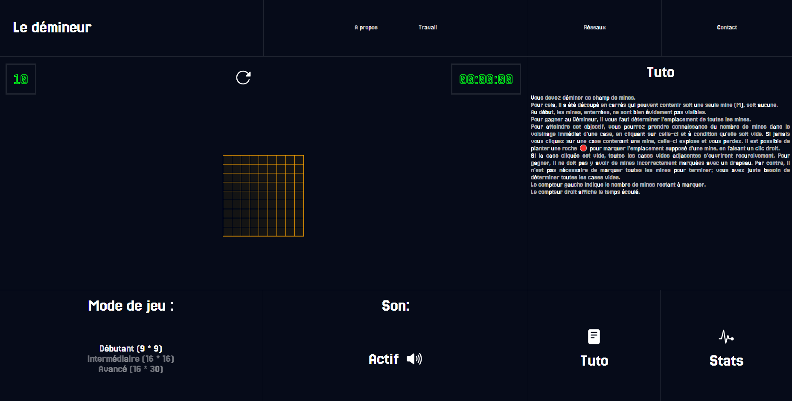
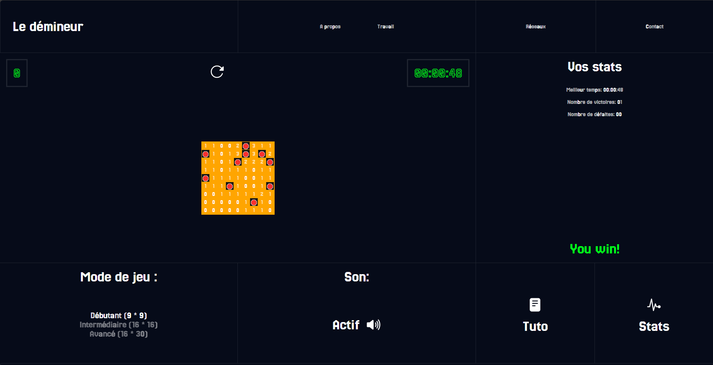

# Minesweeper

Bienvenue dans ce petit projet passe-temps : un jeu de démineur ! Il s'agit d'une version simple et amusante du classique Minesweeper, réalisée en HTML, CSS et JavaScript.



## Description

Ce projet est une façon amusante de passer le temps en codant un jeu de démineur. Le but est de découvrir toutes les cases d'une grille sans cliquer sur une mine. Chaque case indique combien de mines se trouvent dans les cases voisines, et le joueur doit utiliser ces indices pour éviter les mines.

### Fonctionnalités

- **Grille de jeu dynamique** : La grille s'adapte à la taille spécifiée.
- **Indicateurs de mines** : Chaque case indique le nombre de mines adjacentes.
- **Marquage de mines** : Les joueurs peuvent marquer les cases où ils pensent qu'il y a des mines.
- **Gestion des parties** : Détection de la victoire et de la défaite.

## Installation

1. Clonez le dépôt :
    ```sh
    git clone https://github.com/Mosah04/minesweeper.git
    ```
2. Ouvrez le fichier `index.html` dans votre navigateur.

## Utilisation

- Cliquez sur une case pour la révéler.
- Faites un clic droit pour marquer ou dé-marquer une mine.
- Le jeu se termine lorsque toutes les mines sont marquées correctement ou lorsqu'une mine est cliquée.

## Améliorations à venir

- **Responsive Design** : Adapter le jeu pour qu'il soit parfaitement jouable sur mobile et tablettes.
- **Améliorations graphiques** : Ajout d'animations et d'effets visuels pour améliorer l'expérience utilisateur.
- **Sauvegarde des scores** : Implémentation d'un système de sauvegarde et de classement des scores des joueurs.

## Captures d'écran



## Contribuer

Les contributions sont les bienvenues ! Si vous avez des suggestions, des améliorations ou des correctifs, n'hésitez pas à ouvrir une issue.

## Liens utiles

- [Minesweeper sur Wikipedia](https://fr.wikipedia.org/wiki/D%C3%A9mineur_(genre_de_jeu_vid%C3%A9o))
- [Règles du jeu](https://fr.wikipedia.org/wiki/D%C3%A9mineur_(genre_de_jeu_vid%C3%A9o)#R%C3%A8gles_du_jeu)
